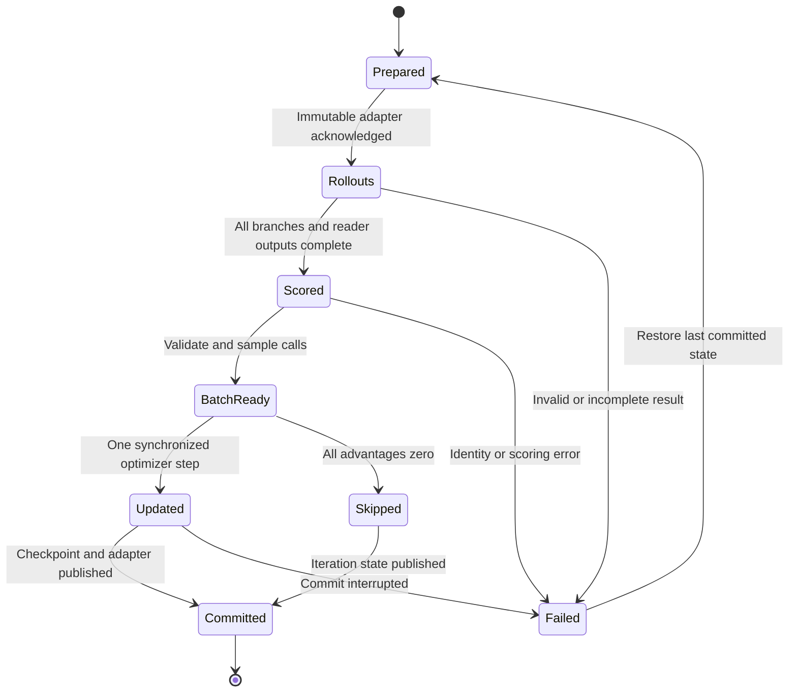

# Runtime wiring and process contracts

This document defines the production implementation to build. It does not claim that the included CPU reference implements model inference, LoRA training, vLLM, GPU scheduling, or benchmark-scale execution. Names under `memrl.runtime`, `memrl.rl.trainer`, and `memrl.eval.run` below are **REQUIRED TARGET INTERFACES**. Implement them through the locked public contracts; do not fill missing runtime paths with random scores, mock model text, or fabricated successful status.

Use the root specification for scientific definitions and `FOUR_H100_RUNBOOK.md` for deployment. If a contract needs changing, update the schema, its fixtures, dependent task packets, tests, and resolved configuration together before dependent agents proceed.

## 1. Process ownership and trust boundary

| Component | Reads | Writes | Prohibited responsibility |
|---|---|---|---|
| CPU supervisor | Resolved config, hardware locks, resource ledger | Leases, child logs, process health | Sampling actions or modifying rewards |
| Trusted controller | Public manifests and private labels/query manifests; immutable results | Jobs, reader jobs, rewards, training plan, checkpoints | Adding private data to writer prompts |
| Writer environment | Arrived public chunks, charged memory, permitted current tool state | Actions, public trace, memory snapshots | Reading future chunks, hidden questions, evidence labels, rewards, or another branch's state |
| vLLM model worker | Exact prompt IDs, sampling parameters, explicit adapter request | Completion IDs and aligned behavior logprobs | Discovering private scoring files or selecting favorable responses |
| Frozen-reader dispatcher | Frozen snapshot and selected question after memory completion | Exact reader prompt/response records | Feeding reader output or reward back into memory construction |
| Trusted scorer | Reader output, private answer/evidence labels | Typed score and diagnostics | Giving gold text to writer/reader generation |
| Trainer rank | Trusted completed loss batch, immutable behavior adapter | Gradient/optimizer state; rank-0 checkpoint material | Calling tools or re-generating completions during loss computation |
| Evaluator/aggregator | Locked manifest and complete outputs | Metrics, uncertainty intervals, audit tables | Choosing a checkpoint on final test performance |

Writer policy blindness means the actual tokens and tool-visible state are independent of hidden questions/labels. A Python class with a `private` field is not a security boundary. Use separate record types and explicit allowlists; prefer separate scoring/controller processes. Never pass an entire combined dataset row into prompt formatting. If controller and model server share a machine, log public request envelopes so blindness is auditable.

The rollout worker may service both writer and reader requests to reuse base weights, but each request explicitly declares its role and adapter. Reader requests are created only after snapshot finalization. Role switching does not create a conversation shared between them.

## 2. Authoritative identities

Define stable SHA-256 identities over canonical UTF-8 JSON or byte artifacts. Do not use Python's process-randomized `hash()`.

| Identity | Includes |
|---|---|
| `protocol_id` | Scientific config: observation/chunking, memory charging, capacity, generation constraints, reward, method, branching, decoding, selection and evaluation rules |
| `execution_id` | Protocol ID, code commit, environment lock, hardware lock, training seed, deployment mode, start nonce |
| `adapter_sha256` | Manifest plus every adapter weight/config file; immutable base-model identity also recorded |
| `snapshot_sha256` | Canonical charged memory, semantic environment cursor/version, protocol ID; distinguish policy-visible memory digest from full trusted snapshot digest |
| `prompt_sha256` | Exact prompt token IDs plus tokenizer/chat-template identity and role |
| `request_id` | Execution, iteration, group, prefix trajectory, branch, call index, role; unique within execution |
| `cache_key` | Exact prompt IDs, model/base revision, adapter hash or explicit null, tokenizer/template, generation parameters, stop rules, numerical/runtime settings relevant to output |
| `job_id` | Immutable job-manifest bytes; retries retain same semantic job ID and add an attempt ID |

Record capacities in charged reference-tokenizer tokens and prompt lengths in each model's own tokenizer separately. A renamed model, tokenizer, memory serializer, reader order, or generation template is not the same experiment merely because the numerical capacity is unchanged.

## 3. Required interfaces between agent-owned modules

These are type-level pseudocode signatures. Referenced types must be defined in the shared contracts module before adapters are implemented. Return immutable records or defensive copies; do not expose mutable memory dictionaries across branches.

```python
from typing import Protocol, Sequence

class EnvironmentAPI(Protocol):
    def observe(self) -> "PublicObservation": ...
    def apply(self, action: "ParsedAction") -> "PublicStepResult": ...
    def snapshot(self) -> "EnvironmentSnapshot": ...
    def fork(self, snapshot: "EnvironmentSnapshot",
             continuation: "ContinuationHandle") -> "EnvironmentAPI": ...
    def finalize(self) -> "FrozenMemory": ...

class PromptAPI(Protocol):
    def writer(self, observation: "PublicObservation") -> "TokenizedPrompt": ...
    def reader(self, memory: "FrozenMemory",
               question: "PublicQuestion") -> "TokenizedPrompt": ...

class ModelWorkerAPI(Protocol):
    def prepare_adapter(self, adapter: "ImmutableAdapterRef") -> "AdapterAck": ...
    def generate(self, requests: Sequence["GenerationRequest"]
                 ) -> Sequence["GenerationResult"]: ...
    def drain(self) -> "DrainAck": ...
    def health(self) -> "WorkerHealth": ...

class ScoringAPI(Protocol):
    def score(self, output: "ReaderOutput",
              target: "PrivateTarget") -> "ScoreRecord": ...

class TrainingAPI(Protocol):
    def validate_batch(self, batch: "TrainingBatch") -> None: ...
    def update_once(self, batch: "TrainingBatch") -> "UpdateResult": ...
    def save_complete(self, state: "IterationState") -> "CheckpointRef": ...
```

All production deserializers reject unknown schema versions and malformed/missing fields; do not silently use convenient defaults for capacity, adapter, role, question visibility, branch count, or loss denominator. Configuration is resolved once, emitted as immutable JSON/YAML, and passed by path/hash; child processes do not independently merge different defaults.

## 4. Job and result schemas

Use job schema 3 for the continuation extension. Explicitly migrate legacy schema 2 jobs or reject them. Below, strings in angle brackets denote values supplied by the controller, not literal executable manifests.

Writer job (public observation access only):

```json
{
  "job_schema": 3,
  "job_id": "<sha256>",
  "execution_id": "<id>",
  "iteration": 20,
  "kind": "writer_prefixes_and_suffixes",
  "protocol_id": "<sha256>",
  "adapter": {
    "path": "<immutable-directory>",
    "sha256": "<sha256>",
    "version": 21,
    "base_revision": "<immutable-revision>"
  },
  "public_manifest_sha256": "<sha256>",
  "groups": [
    {
      "group_id": "<world-condition-id>",
      "prefix_id": "<public-prefix-id>",
      "trajectory_ids": ["g0", "g1", "g2", "g3"],
      "continuation_handles": ["k0", "k1"],
      "capacity_tokens": 1024,
      "seed_manifest_sha256": "<sha256>"
    }
  ]
}
```

A continuation handle is resolved by a trusted environment feeder only when suffix chunks are scheduled. It must not expose a directory of future chunk contents to the writer prompt builder. Private queries and answer labels are absent from this job. The controller maintains separate private query tickets keyed by group/continuation and supplies questions to the reader after the memory hash is frozen.

Every `GenerationRequest` contains schema version, request ID, role (`writer` or `reader`), model/base identity, exact `prompt_ids`, prompt hash, maximum new tokens, effective sampling parameters, seed, and explicit adapter reference or null. The model worker must reject a reader request with the current writer adapter unless this is an explicitly named reader-training/attribution arm. It may accept extra trusted audit metadata but never append that metadata to the prompt.

Every `GenerationResult` contains request ID, attempt ID, adapter/base identities actually used, exact generated token IDs, aligned sampled-token log probabilities for writer requests, text for inspection, finish reason, stop/EOS handling, prompt/generation token counts, timings, worker ID, engine version, and status. Token IDs are authoritative. Decoding and re-tokenizing generated text is forbidden for constructing the training loss.

Every writer call trace contains environment state hash before/after, chunk index, call index, origin (`policy` versus `script`), raw token IDs, parse outcome, parsed action, tool result, all charged memory lengths, budget rejection details, and prompt-visible ledger. Scripted baseline actions never enter RL training samples. Invalid actions remain in the trace and receive the predeclared environment transition; they are not silently replaced by successful edits.

Reader jobs contain frozen memory hash, question ID/text, reader model identity, reader adapter null, prompt IDs/hash, deterministic decoding, and output key. Gold answers are supplied only to the scorer. Scores bind to output hash, question ID, private-label manifest hash, scorer version, and protocol ID.

## 5. Queue layout and atomic publication

Required per-run paths, shown as a path table rather than an executable file tree:

| Path | Role |
|---|---|
| `runs/<execution>/resolved.json` | Immutable resolved scientific/runtime configuration |
| `runs/<execution>/locks/` | Copied lock manifests and environment metadata |
| `runs/<execution>/queue/iter_00020/jobs/` | Atomic immutable writer/reader job JSON |
| `runs/<execution>/queue/iter_00020/attempts/` | Attempt-specific partial results and error reports |
| `runs/<execution>/queue/iter_00020/results/` | Validated content-addressed results |
| `runs/<execution>/queue/iter_00020/DONE.json` | Expected counts and hashes; only after all results validate |
| `runs/<execution>/queue/iter_00020/train_batch/` | Safe tensor payload, metadata and READY manifest |
| `runs/<execution>/artifacts/sha256/` | Compressed token traces, snapshots and prompts |
| `runs/<execution>/adapters/v000021/` | Immutable published adapter and checksums |
| `runs/<execution>/checkpoints/step_000020/` | Complete model/optimizer/sampler/RNG state |
| `runs/<execution>/events.jsonl` | Structured event log |
| `runs/<execution>/resource_ledger.jsonl` | Device allocation intervals, retries, cost |
| `runs/<execution>/logs/` | Role-specific stdout/stderr |
| `runs/<execution>/private/` | Private query/label references; not a model-worker input |

Write files to unique temporary paths on the same filesystem, flush and fsync, validate content/hash, then atomically rename. Publish a marker only after referenced artifacts exist and validate. A DONE file without matching expected counts and checksums is corruption, not success. For crash durability, fsync the containing directory when supported by the target filesystem. Shared/network filesystems require an explicit visibility/atomicity probe before use; local NVMe is the initial queue target.

Use compressed JSONL plus safe tensors/NPZ as appropriate. Do not load arbitrary Python pickles from external sources. For internally generated torch state, use the safe loading options supported by the pinned version and keep payloads to dictionaries/tensors/primitives. Verify all loaded hashes before deserializing large objects.

## 6. One iteration's state machine



The controller owns state transitions and emits transition events with hashes. Workers cannot independently advance iteration or adapter version. The same adapter is used for prefix generation, all K suffix continuations, and trainer likelihood recomputation. All branches finish before the optimizer step. Validation jobs also use explicit immutable adapter identities; they cannot hot-swap a worker during an active training iteration.

Pseudocode for orchestration, to implement after the contracts and tests:

```python
def run_iteration(state, cfg, controller, workers, trainer):
    adapter = controller.require_committed_adapter(state)
    plan = controller.make_iteration_plan(state, cfg)
    controller.publish_plan(plan)
    workers.prepare_and_ack(adapter)

    prefixes = controller.collect_complete_prefixes(plan, workers)
    branches = controller.collect_all_suffixes(plan, prefixes, workers)
    memories = controller.validate_and_freeze(branches)
    reader_outputs = controller.read_frozen_memories(plan, memories, workers)
    scores = controller.score_private_targets(plan, reader_outputs)

    batch = controller.build_and_validate_training_batch(
        plan, prefixes, branches, scores, behavior_adapter=adapter
    )
    controller.publish_ready(batch)
    if batch.all_advantages_zero:
        update = trainer.skip_without_optimizer_or_scheduler_step(batch)
    else:
        update = trainer.update_once(batch)
    return controller.commit_iteration(state, plan, update)
```

This pseudocode deliberately separates prefix and suffix collection for auditability. The production scheduler may dispatch a group's suffixes after its prefixes are complete while other groups are still generating, provided dependencies, behavior adapter, seeds, information boundaries, and final complete-batch barrier are unchanged.

## 7. Branch-state correctness

An environment fork deep-copies mutable semantic state: canonical memory entries and ordering, store version, chunk cursor, current-chunk call budget, pending public tool result, loaded-entry state if permitted at the branch boundary, and branch-local action RNG. Copy only state that the scientific protocol allows to persist. Snapshot at a documented chunk boundary; clear per-chunk temporary fields according to the environment rules. Do not accidentally carry loaded text across boundaries because cloning preserved a cache.

The trusted continuation feeder owns future events, event schedules, and hidden query sampling. Its private state is separate from the policy-visible environment snapshot. Every branch sees its own continuation as observations arrive. Sibling branches cannot inspect one another's memory or actions. Branch IDs, seed IDs, and continuation labels are audit metadata and are not prompt tokens unless the protocol explicitly makes them public.

Use hierarchical deterministic seeds derived from stable IDs, with distinct streams for data, prefix actions, suffix actions, query selection, call sampling, and bootstrap analysis. The seed derivation must be insensitive to worker count, completion order, and retry attempt. A generation retry repeats its semantic seed. GPU sampling can still show batching/kernel-dependent numerical differences; log realized output hashes and probe reproducibility instead of promising bitwise identity.

Required tests: modifying one branch cannot change another; taking a snapshot cannot mutate the live parent; serialization round trip preserves visible prompts; adding an unused private question cannot change writer prompts; prefix trace contributes to training exactly once; continuation handles cannot be resolved early by prompt code; reordering worker completion preserves semantic IDs and selected training calls.

## 8. Training-batch coefficient and DDP contract

Let N=H*G count independently sampled prefix trajectories, K be the continuation count, and Z the fixed loss scale (reference 256). Let `A[h,g,k]` be the branch advantage computed by the method's approved baseline; its derivation belongs in the method specification. Then assign:

```text
prefix call coefficient(h,g)   = mean_k A[h,g,k]
suffix call coefficient(h,g,k) = A[h,g,k] / K
loss = -sum_calls coefficient(call) * sum_completion_logp(call) / (N*Z)
```

Do not materialize K duplicated prefix traces in the loss dataset. The runtime may attach K references to one prefix trace for reward lineage, but its contribution is one record with the mean coefficient. K=1 must reduce to the reference trajectory estimator.

With uniform eligible-call subsampling, retain probability `p=m/M` and multiply each selected contribution by `1/p`. If zero-coefficient calls are removed, preserve the original fixed N*Z denominator. If stratified, record each stratum's inclusion probability. A selected call contains exact prompt/completion IDs, aligned behavior logprobs, coefficient, inclusion probability, trace identity, and adapter hash. All selected calls must match the batch's behavior adapter.

For W DDP ranks, multiply local loss contributions by W before DDP's gradient average, accounting for any deliberate duplicate weights. Equalize backward-call counts across ranks; sequence-length balancing must not alter sample weights. For one eligible call and two ranks, give each rank a copy with half the logical contribution, retaining correct inclusion probability. With `no_sync()`, perform the last required backward in a synchronized context on every rank. Empty batches cause all ranks to skip optimizer and scheduler steps. A skipped sampled iteration is distinct from a successful optimizer step.

The trainer uses completion tokens only, fp32 log-softmax for likelihood extraction, zero LoRA dropout and verified other dropout behavior, and one optimizer step per sampled iteration. It never re-tokenizes completions or optimizes frozen-reader tokens. Gradient clipping occurs once after accumulation; report the unclipped norm. Claimed unbiasedness of call subsampling concerns the estimated loss/gradient before nonlinear clipping and Adam updates.

## 9. Adapter publication and cache lifecycle

Rank 0 writes a new adapter to a unique temporary directory, fsyncs/validates required files, computes its manifest/hash, and renames to an unused final version path. Workers drain all old-version requests, then load or register the new immutable adapter and acknowledge its hash. Use distinct positive adapter IDs; never reuse one ID for different weights, even if an API supports in-place reload. The conservative immutable-version contract is easier to audit than hot replacement.

The reference worker shares base parameters for writer and reader. It does not merge the writer LoRA permanently into the base engine. A base reader request must pass `None`; a request-local default left over from a preceding writer request is a correctness failure. Verify realized adapter dtypes and target modules match training. Bound adapter residency and use only the API-probed unload/restart mechanism.

Automatic prefix caching is an inference optimization, not agent memory. Identical text is insufficient for cache identity if adapter, base model, tokenization, or other forward semantics differ. Never reuse writer-adapter KV for the frozen base reader or across adapter versions. If the pinned engine's cache key cannot be demonstrated to isolate these requests, disable that cache or restart/reset through a verified API. Environment snapshots never contain reusable cross-version model KV.

The documented prefix-sharing benefit comes from generating a policy prefix once and forking its environment state. It does not require a custom KV-fork implementation or imply that all later branch prompts have common model attention prefixes. Treat optional KV reuse as a separate measured optimization.

## 10. Failure, retries, and restart

Maintain a finite error taxonomy: invalid policy action (scientific outcome), decode timeout, worker death, OOM, missing/misaligned token logprobs, adapter mismatch, hash corruption, incomplete result, scorer error, DDP error, and checkpoint commit failure. Only invalid policy actions continue under the environment's declared rules. Infrastructure errors never become reward-zero examples.

Each retry keeps the semantic job ID, histories, question selection, continuation manifests, seeds, and adapter; it receives a new attempt ID. Adopt results only after validation and keep exactly one complete adopted result per semantic request. Conflicting complete attempts are auditable duplicates, not independent experimental samples. Never select the attempt with a higher reward. Define deterministic adoption (first successfully validated complete attempt, with event order recorded) and record all attempts.

Checkpoint commit is the only durable evidence that an optimizer step is complete. Restore the prior committed state after an interrupted update/commit; reuse prior rollout artifacts only if their behavior adapter and complete semantic manifest match. Cost accounting includes failed attempts and replay. On fatal supervisor exit, release leases only after owned children stop and the final resource interval is written.

Health records are separate from progress records: heartbeat can continue while generation is deadlocked. Record both. Every child has startup, progress, and shutdown deadlines. Trainer ranks wait for READY through CPU polling/IPC; they enter only short coordinated collectives after the batch is ready. Rank 0 failure must terminate/restart the rank group, not leave rank 1 hanging indefinitely.

## 11. Evaluation/cache integrity

Evaluation manifests enumerate expected history, branch, question, method, seed, checkpoint, and capacity combinations. Partition by stable hash of complete history/prefix group. A final reducer checks that every key occurs exactly once and that all IDs/hashes agree. Emit missing/duplicate records as a failed evaluation status, not a shorter denominator.

Freeze memory once per history/branch, then answer questions independently. Primary all-retained reading exposes every charged retained token within the reader allowance; no retrieval selector may hide evidence in that arm. Reader outputs cannot mutate memory. Same answer text from different questions is not a shared cache key. Cache identity includes prompt bytes/token IDs, model/adapter, decoding, protocol, and memory order. Report cold generation cost and warm cache-assisted replay separately.

Private final-test manifests are accessible to evaluation only after development selection and the analysis plan are locked. Evaluation metrics may be computed by the trusted reducer, but they must not become an online reward/training signal. A separate adaptation study needs separate IDs/splits and cannot inherit a zero-shot label.

## 12. Production acceptance checklist

- Full public/private request traces demonstrate writer blindness, including during forks and error recovery.
- Budget invariant holds after every edit, failed edit, serialized reload, and branch fork; all visible persistent channels are charged.
- Writer LoRA/base reader isolation and numerical logprob parity are measured on target GPUs.
- Exactly one adapter version spans a complete training iteration, with no stale request admitted.
- Prefix/suffix coefficients, inclusion weights and DDP scaling match a small exact gradient reference.
- One production-model iteration, all-zero skip, odd batch and single-call cases complete on the target topology.
- Forced worker death, OOM handling and commit interruption preserve semantic manifests and correct resume behavior.
- All four-GPU evaluation shards merge without omissions or duplicates; CPU and production scoring agree on shared fixtures.
- Resource ledger accounts for reserved idle time, retries, validation, profiling and checkpoint overhead.
- Runtime release status explicitly distinguishes CPU-verified contracts, GPU-smoke-verified components, and benchmark-validated experimental results.

The controller must refuse a full study when any mandatory gate is absent. This is an implementation gate, not a prediction of research success or conference acceptance.
